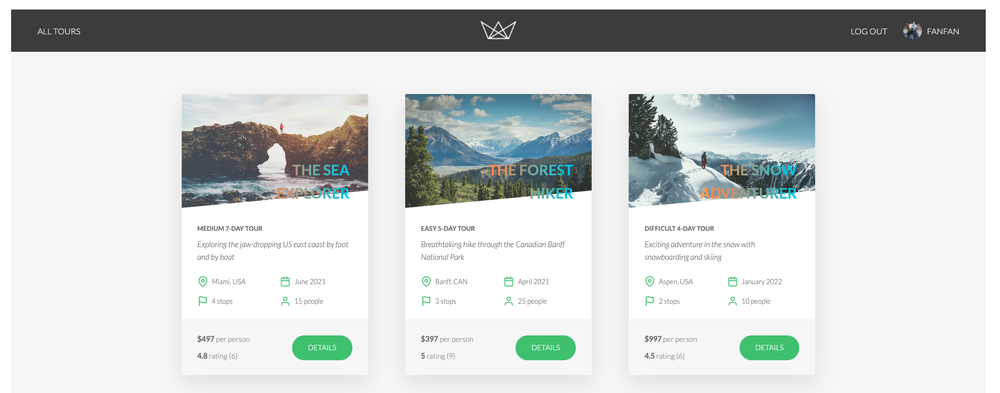
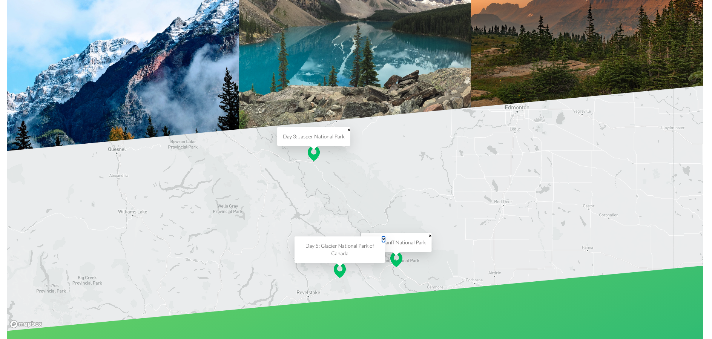
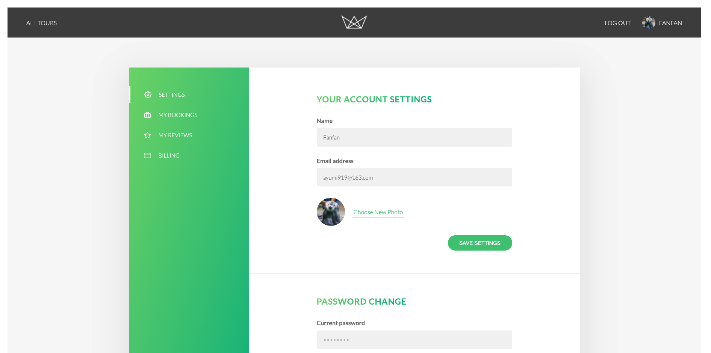
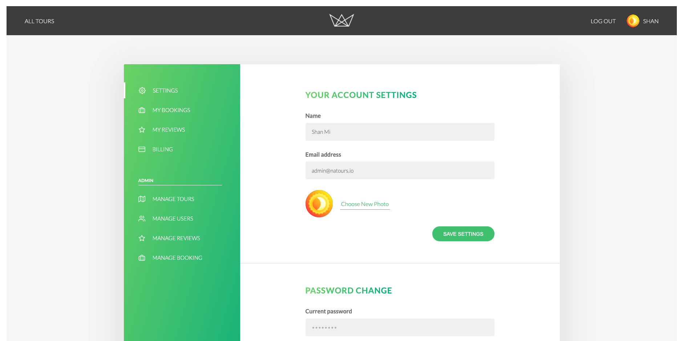

# Natour
[DEMO](https://natour-sm.herokuapp.com/) *have bugs need to be fixed*

> Added some new stuff after taking Scott's node courses from FrontendMasters

**TO BE CONTINUED...**

## FEATURES
- jwt for login auth
- geospacial in MongoDB
- Using sendMail for sending emails on production mode
